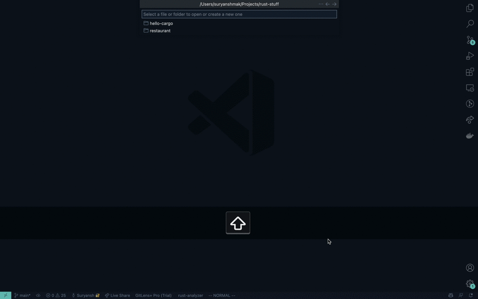
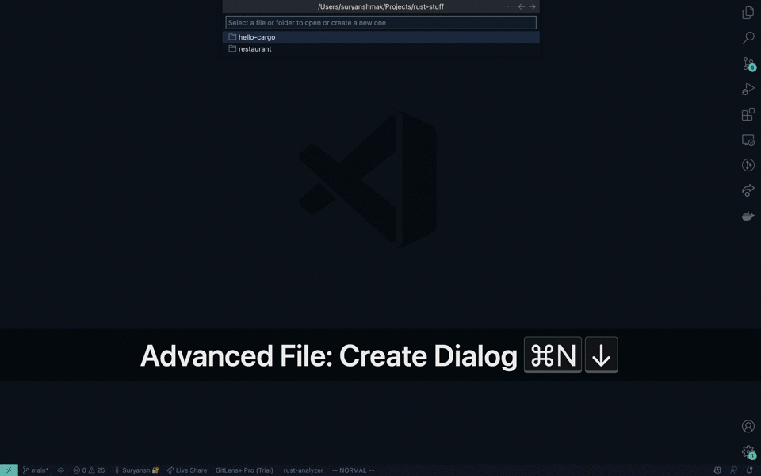

<p align="center">
  
  
</p>

## Features

- No need to rely on `vscode.quickOpen`
- Create, rename, delete, open files/folders without relying on the sidebar



- Jump to specific lines
- Find specific symbols



## Requirements

Setting up a local environment

1. Cloning the repository

```
git clone https://github.com/suryanshmak/vscode-advanced-file.git
```

2. Install node_modules

```
yarn install
```

3. Run the extension!

## Extension Settings

- `advanced-file.open`: cmd/ctrl+shift+p -> Advanced File: Create Dialog

## Release Notes

### 1.0.0

Initial release of advanced-file

### [CHANGELOG](https://github.com/suryanshmak/vscode-advanced-file/blob/main/CHANGELOG.md)
